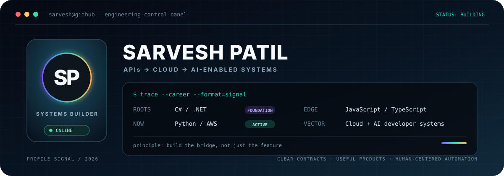
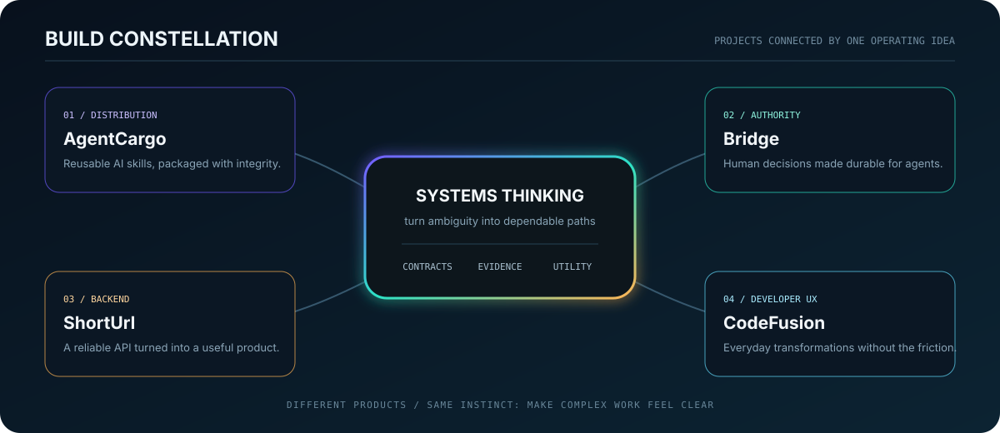

<p align="center">
  
</p>

<p align="center">
  <a href="https://github.com/PatilSarvesh"></a>
  <a href="https://sarvesh-patil.netlify.app/"></a>
  <a href="https://x.com/sarvesh_goudru"></a>
</p>

<p align="center">
  <strong>I turn ambiguity into systems:</strong><br/>
  contracts underneath · cloud in the middle · useful product at the edge
</p>

---

## `01 / operating mode`

I'm not attached to one stack. I'm attached to making the system understandable, dependable, and useful.

```text
FOUNDATION  C# / .NET       → architecture, APIs, contracts, reliability
CURRENT     Python / AWS    → cloud-native systems, automation, scale
PRODUCT     JS / TS         → interfaces, CLIs, integrations, developer UX
DIRECTION   Cloud + AI      → practical systems where humans stay in control
```

Right now I'm moving deeper into **Python and AWS**, while carrying forward the engineering discipline I developed with **.NET**. I use **JavaScript and TypeScript** when the backend needs to become something people can actually operate, understand, and enjoy using.

## `02 / build constellation`

<p align="center">
  
</p>

### [AgentCargo](https://github.com/PatilSarvesh/AgentCargo) `AI tooling · TypeScript · PostgreSQL`

A cross-agent registry and package manager for reusable AI-agent skills. It explores deterministic packaging, integrity verification, versioning, authentication, publishing, and installation across agent hosts.

### [Bridge](https://github.com/PatilSarvesh/Bridge) `Agent systems · TypeScript · REST · MCP`

A shared decision and specification control plane for teams working with AI agents—designed around human authority, durable context, governed decisions, and auditable workflows.

<details>
<summary><strong>More from the build archive</strong></summary>
<br/>

- [**ShortUrl**](https://github.com/PatilSarvesh/ShortUrl) — a .NET 8 URL-shortening product with MongoDB, React, custom links, expiry, and redirect analytics.
- [**CodeFusion**](https://github.com/PatilSarvesh/CodeFusion) — a developer toolbox for data conversion, validation, inspection, and repeatable utility workflows.
- [**BasicRAG**](https://github.com/PatilSarvesh/BasicRAG) — a local RAG experiment using Ollama and Qdrant.
- [**ParkMate**](https://github.com/PatilSarvesh/ParkMate) — a parking-slot booking application spanning backend APIs and a browser interface.

</details>

## `03 / principles I keep`

```text
clear contracts        > hidden assumptions
security evidence      > decorative trust scores
human authority        > silent automation
useful software        > impressive demos
```

These show up repeatedly in what I build: explicit boundaries, safe defaults, observable behavior, and interfaces that explain what the system is doing.

## `04 / toolkit by responsibility`

| Signal | Tools |
|---|---|
| **Building now** | Python · AWS · cloud architecture · automation |
| **Backend memory** | C# · .NET · ASP.NET Core · REST APIs |
| **Product edge** | TypeScript · JavaScript · React · Node.js |
| **Data and delivery** | PostgreSQL · MongoDB · Qdrant · GitHub Actions · Git |

<p align="center">
  
</p>

<details>
<summary><strong>GitHub telemetry</strong></summary>
<br/>
<p align="center">
  
  
</p>
</details>

## `05 / open channel`

- 🌐 [Portfolio](https://sarvesh-patil.netlify.app/)
- 𝕏 [@sarvesh_goudru](https://x.com/sarvesh_goudru)
- 🧭 [Explore my repositories](https://github.com/PatilSarvesh?tab=repositories)

---

<p align="center">
  <code>currently refactoring the distance between an idea and dependable software.</code>
</p>
